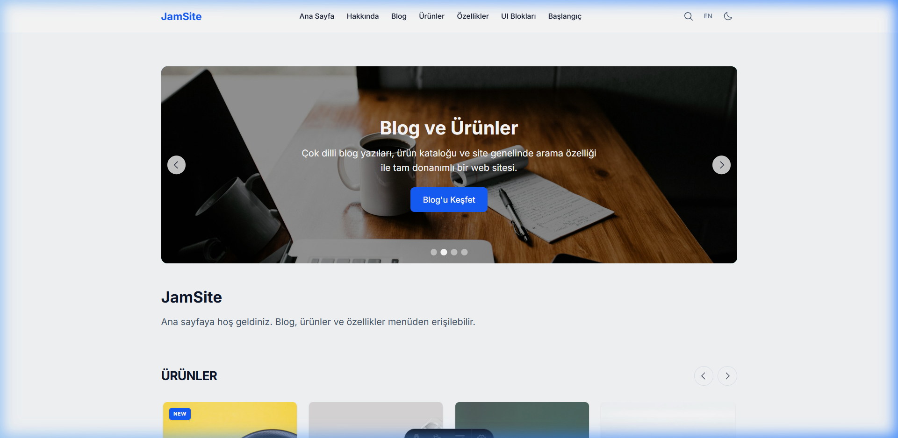
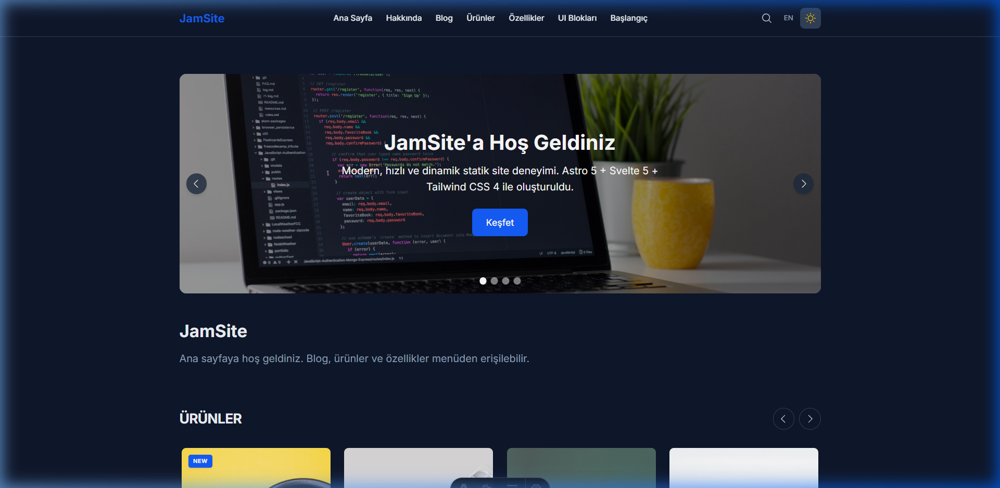
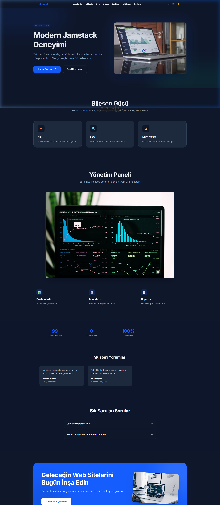
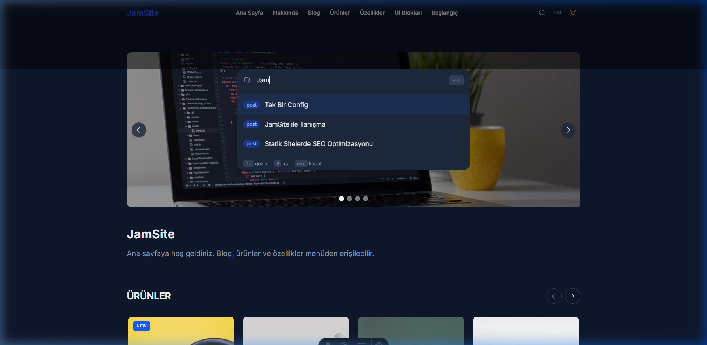

# JamSite 🚀

[](https://opensource.org/licenses/MIT)
[](https://astro.build)
[](https://svelte.dev)
[](https://tailwindcss.com)

**Modern, hızlı ve modüler Jamstack tabanlı web sitesi şablonu.** Astro 6, Svelte 5 ve Tailwind CSS 4'ün gücüyle projenizi saniyeler içinde ayağa kaldırın.

[English Documentation](./README.md) | [Türkçe Dokümantasyon](./README_TR.md)

---

## ✨ Görsel Şölen (Showcase)

### 🌓 Karanlık & Aydınlık Tema
Tek tıkla pürüzsüz geçiş yapan, göz dostu ve modern tasarım.

| Aydınlık Mod | Karanlık Mod |
| :---: | :---: |
|  |  |

> **Deneyim:** [Tema Geçişi Animasyonu](src/assets/img/dark-mode-toggle.webp)

### 🧱 Modüler UI Blokları
Tailwind Plus ilhamlı, Markdown üzerinden yönetilebilen profesyonel ve varyasyonlu bileşenler.



> **Kayıt:** [Bloklar Arası Gezi](src/assets/img/ui-blocks-scroll.webp)

### 🔍 Akıllı Arama & Etkileşim
Build-time indexlenen, Fuse.js tabanlı, süper hızlı Cmd+K arama deneyimi.



---

Astro 6, Svelte 5 ve Tailwind CSS 4 ile kurulmuş çok dilli statik site şablonu. Blog (etiket/kategori), ürün kataloğu, site içi arama (Cmd+K), karanlık/aydınlık tema, dinamik slider ve PWA desteği içerir.

Oluşturan: [Bahadır Doğru](https://bahadirdogru.com)

İçerik ve SEO Astro ile üretilir; etkileşimli bileşenler Svelte ile yazılır ve gerekli sayfalarda hydrate edilir. Build çıktısı (`docs/`) herhangi bir statik hostinge (GitHub Pages dahil) deploy edilebilir.

## Özellikler

- **Blog** — Content Collections ile yazılar, etiket/kategori, dil bazlı listeler, okuma süresi, sosyal paylaşım
- **Ürün kataloğu** — SKU bazlı YAML veri, çok dilli destek, favoriler, karşılaştırma
- **Site araması** — Cmd+K / Ctrl+K ile Fuse.js tabanlı, build-time index
- **Karanlık / aydınlık mod** — FOUC önlemli tema, OS tercihi ve localStorage
- **Dinamik slider** — Dil bazlı veri, hero/image slide tipleri, autoplay
- **Çok dilli (i18n)** — TR /tr/, EN /en/ prefix; hreflang ve dil değiştirici
- **SEO** — Meta, Open Graph, Twitter Card, sitemap, RSS
- **Etkileşimli bileşenler** — Favoriler, okuma listesi, hızlı önizleme, karşılaştırma, klavye kısayolları
- **Animasyon** — Motion + Astro View Transitions
- **PWA** — Service Worker (vite-plugin-pwa), manifest
- **Progressive enhancement** — İçerik JS olmadan okunabilir

## Gereksinimler

- [Node.js](https://nodejs.org/) (v22+)
- Git

## Kurulum

```bash
git clone https://github.com/<kullanici>/JamSite.git
cd JamSite
npm install
```

## Geliştirme

```bash
npm run dev
```

Astro dev server başlar (varsayılan http://localhost:4321). Hot reload açıktır.

## Build

```bash
npm run build
```

Sırasıyla:

1. `src/lib/search-index.js` — arama indeksini `public/search-index.json` olarak üretir  
2. `astro build` — siteyi `docs/` altına derler  

## Önizleme

```bash
npm run preview
```

`docs/` çıktısını yerel sunucuda dener.

## Deploy

```bash
npm run build
```

Ardından `docs/` klasörünü hostinge yükleyin (GitHub Pages için `docs` içeriğini repo’ya veya gh-pages branch’ine push edebilirsiniz; Actions ile otomatik build de kullanılabilir).

## Proje yapısı

```
src/
  config/             site.js — tekil config (site, features, i18n; Jekyll _config benzeri)
  components/         Svelte bileşenleri
  content/
    posts/           Blog yazıları (.md)
    pages/           Hakkında, Başlangıç rehberi (.md, tr/en)
    products/        Ürünler (.md frontmatter)
    slides/          Slider slide’ları (.md, lang + order)
  data/              products.js, slides.js (content’ten okur)
  i18n/              tr.js, en.js, index.js (UI çevirileri)
  layouts/           BaseLayout.astro
  lib/               search-index.js (build-time arama indeksi)
  pages/             Astro sayfaları ([lang] prefix yapısı)
  styles/            global.css (Tailwind, @theme)
```

## Site yapılandırması

Tüm site ayarları **`src/config/site.js`** dosyasından yönetilir (Jekyll’deki `_config.yml` gibi):

- **site**: `title`, `description`, `url`, `baseUrl` — sitemap, canonical ve RSS için.
- **features**: Blog, ürünler, arama, PWA, RSS, koyu mod, sitemap, etiketler, kategoriler, özellikler sayfası ve başlangıç rehberi açılıp kapatılabilir (`true`/`false`). Kapalı özellikler menüde görünmez ve ilgili sayfalar 404 döner.
- **i18n**: `languages`, `defaultLang` — yeni dil eklemek için sadece `languages` dizisine kod eklemeniz yeterli.

Build, layout, feed ve arama indeksi bu dosyayı tek kaynak olarak kullanır.

## Teknoloji

- **SSG**: Astro 6  
- **UI**: Svelte 5 (client:visible / client:load)  
- **Stil**: Tailwind CSS 4 (CSS-first)  
- **İkonlar**: Phosphor Icons (Svelte)  
- **Animasyon**: Motion + Astro View Transitions  
- **Arama**: Fuse.js + build-time JSON index  
- **SEO**: Astro meta + @astrojs/sitemap  
- **RSS**: @astrojs/rss (feed.xml.js)  
- **PWA**: vite-plugin-pwa  

## Yeni dil ekleme

1. **`src/config/site.js`** içinde `languages` dizisine yeni dil kodunu ekleyin (örn. `"de"`).  
2. `src/pages/[lang]/` dinamik yapısı sayesinde yeni dil otomatik desteklenir (gerekirse yeni özel sayfalar eklenebilir).
3. `src/i18n/{dil}.js` ekleyip `src/i18n/index.js` içinde kullanın.  
4. İsteğe bağlı: `src/content/slides/` altında yeni dil için slide .md dosyaları (örn. de-01.md, lang: de).
5. Ürün .md dosyalarının frontmatter’ında ilgili dil bloğunu (örn. de: title, description, slug) ekleyin.

## Yeni ürün ekleme

1. `src/content/products/{sku}.md` oluşturun (frontmatter’da ortak alanlar + tr/en blokları).  
2. `npm run build` — ürün sayfaları getStaticPaths ile otomatik üretilir.  
3. Arama indeksi ve etiket/kategori listeleri build sırasında güncellenir.  

## Arama

Sayfadayken **Cmd+K** (macOS) veya **Ctrl+K** (Windows/Linux) ile arama modalı açılır. Sonuçlar mevcut sayfa diline göre filtrelenir; tip etiketleri (post, product, page) gösterilir.

## Lisans

MIT
