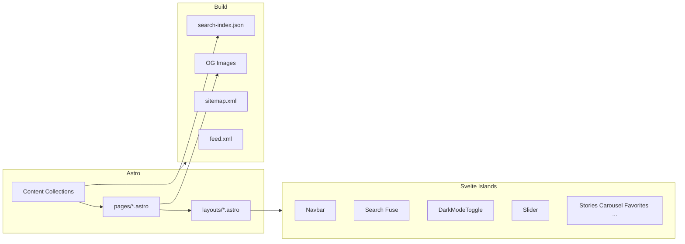

# Jamstack (Astro) Tech Stack Geçiş Planı

Plan tarihi: 2026

## Mevcut durum özeti

- **SSG**: Jekyll 3.9, GitHub Pages
- **UI**: Svelte 5 Custom Elements (`jam-`*), Vite library mode, tek bundle
- **İçerik**: `_pages/{tr|en}/`, `_posts/{tr|en}/`, `_data/products/*.yml`, `_data/i18n`, `_data/slides`
- **Özellikler**: Blog (8 yazı), ürün kataloğu (6 SKU), i18n, Lunr arama, dark mode, Slider, Stories, ProductCarousel, Favorites, Compare, Reading List, PWA

## Hedef mimari




---

## 1. Proje kurulumu ve temel yapı

- **Astro** projesi, mevcut repoda **Jekyll tamamen kaldırılıp** yerine kurulacak (branch ile değil, doğrudan değiştirme). Sürümler: **Astro 5.18.0**, **Tailwind 4.2**, **Svelte 5**; `npm create astro@latest` ile Astro + Svelte + Tailwind seçimi.
- **Klasör yapısı** (hedef):

```
src/
├── components/       # Svelte islands + Astro bileşenleri
│   ├── Navbar.svelte
│   ├── Search.svelte
│   ├── DarkModeToggle.svelte
│   ├── Slider.svelte
│   ├── ...
│   └── (Astro wrapper’lar gerekirse .astro)
├── layouts/
│   └── BaseLayout.astro
├── pages/
│   ├── index.astro
│   ├── [lang]/
│   │   ├── index.astro
│   │   ├── about.astro
│   │   ├── blog/
│   │   │   ├── index.astro
│   │   │   └── [slug].astro
│   │   └── products/
│   │       ├── index.astro
│   │       └── [slug].astro
│   └── tr/ ... en/  # veya getStaticPaths ile [lang]
├── content/
│   ├── config.ts
│   ├── posts/
│   │   └── *.md    # lang, ref frontmatter ile
│   └── products/   # veya data/products + generate
├── assets/
│   ├── fonts/
│   └── og-images/
├── i18n/           # tr.ts, en.ts veya yaml/json
└── lib/
    └── search-index.ts  # Fuse index üretimi
public/
├── search-index.json
├── robots.txt
└── ...
```

- **i18n routing**: Varsayılan dil (tr) root’ta (`/`, `/about/`, `/blog/`), İngilizce `/en/` prefix’inde. **Önerilen yapı**: `src/pages/[lang]/` dynamic segment ile tüm dil sayfaları; `src/pages/index.astro` yalnızca yönlendirici (redirect) veya tr içeriğini render eden wrapper olarak kullanılır. SEO (hreflang) için Astro 5 i18n routing özelliği tercih edilir: `routing: 'prefix-other-than-default'` (varsayılan dil root’ta, diğer diller prefix’li). Hreflang ve dil switcher BaseLayout’ta.

---

## 2. İçerik ve blog (Content Collections + Shiki)

- **Content Collections** ile blog:
  - `src/content/config.ts` içinde `posts` koleksiyonu: `title`, `description`, `date`, `image`, `tags`, `categories`, `ref`, `lang` (schema).
  - Mevcut `_posts/tr/*.md` ve `_posts/en/*.md` dosyaları `src/content/posts/` altına taşınacak; frontmatter uyumlu hale getirilecek (ref, lang korunacak).
  - **Shiki** ile kod vurgulama: Astro’da `markdown.shikiConfig` (veya `@astrojs/markdown-shiki`) kullanılacak; mevcut CopyCode benzeri davranış istenirse Svelte island ile korunabilir.
- **Sayfalar** (about, features, getting-started, blog list, tags, categories):
  - İçerik Astro sayfalarına taşınacak: `_pages/tr/about.md` → `src/pages/tr/about.astro` (veya content collection “pages”).
  - “Pages” için ayrı bir Content Collection da kullanılabilir; dil bazlı listeleme `lang` ile yapılacak.

---

## 3. Ürün kataloğu

- **Seçenek A (önerilen)**: Ürün verisi tek kaynak olarak kalır; Astro tarafında build-time’da sayfa üretimi.
  - Mevcut `_data/products/*.yml` → `src/data/products/` (JSON/TS veya YAML parse) veya aynı yapı `src/content/products/` içinde bir MD per SKU (frontmatter’da tüm diller).
  - `getStaticPaths` ile `[lang]/products/[slug].astro` için tüm dil+slug kombinasyonları üretilir; layout mevcut `_layouts/product.html` mantığına benzer şekilde tek ürün verisi + lang’e göre title/description/slug kullanır.
- **Build script**: Jekyll’deki `scripts/generate-products.js` mantığı Astro’da `getStaticPaths` veya bir `src/pages/products/[lang]/[slug].astro` ile yerleşik hale getirilir; ayrı Node script gerekmez.

---

## 4. SEO, sitemap, RSS, robots

- **Sitemap**: `@astrojs/sitemap` ile `sitemap.xml`; `site` ve i18n URL’leri dahil.
- **RSS**: `@astrojs/rss` ile blog için `feed.xml`; dil bazlı feed istenirse ayrı endpoint’ler (örn. `/feed.xml`, `/en/feed.xml`).
- **robots.txt**: `public/robots.txt` (veya Astro endpoint) ile sitemap referansı.
- **Meta / SEO**: Her sayfa için `BaseLayout.astro` içinde `<title>`, `<meta name="description">`, Open Graph, Twitter Card; mümkünse `@astrojs/seo` veya benzeri kullanılacak.

---

## 5. OG Image

- Blog ve landing için **build-time** OG görselleri:
  - Seçenek 1: `@vercel/og` veya `sharp` + canvas ile Node script; her post/sayfa için başlık + logo/branding ile görsel üretilir, `public/og-images/` veya `dist/` içine yazılır.
  - Seçenek 2: Astro’da her sayfa için dinamik OG route (ör. `pages/og/[...slug].png.ts`) ve build’de static path’lerle çağrı.
- Layout’ta `og:image` her sayfa/post için ilgili OG görseline yönlendirilecek.
- **Uyarı**: Build yerelde alınıp push edildiği için, OG üretim script’inin kullandığı **yerel font dosyaları** ve kütüphanelerin (Satori, Sharp vb.) script ile tam uyumlu olduğundan emin olunmalı; aksi halde farklı ortamda farklı görsel çıktısı veya hata oluşabilir.

---

## 6. Font self-host

- **Google Fonts** kaldırılacak; Inter (veya mevcut font) `src/assets/fonts/` veya `public/fonts/` içinde woff2 olarak tutulacak.
- `BaseLayout.astro` içinde `<link rel="preload">` + `@font-face` (veya Tailwind üzerinden font-family) ile yükleme; CLS için `font-display: optional` veya `swap` tercih edilecek.
- Tailwind `theme` ile `--font-heading` / `--font-body` mevcut tema renkleriyle uyumlu bırakılacak.

---

## 7. Dark mode

- **Tailwind**: Mevcut gibi class strategy (`dark:`); root’ta `.dark` sınıfı.
- **Svelte island**: `DarkModeToggle.svelte` (mevcut ThemeToggle mantığı); `client:visible` veya `client:load` ile hydrate.
- **FOUC önleme**: `<head>` içinde inline script (mevcut default.html’deki gibi) localStorage + `prefers-color-scheme` ile ilk render’dan önce `.dark` uygulanacak.

---

## 8. View Transitions

- **Astro 5.18.0** ile View Transitions kararlı (stable) özelliktir. Layout’a **`<ViewTransitions />`** eklenir (ör. `BaseLayout.astro` içinde `<head>` veya `<body>`).
  - Sayfa içi linkler (`<a>`) Astro tarafından yakalanıp SPA-benzeri geçişle yüklenecek.
- Mevcut View Transitions API kullanımı (main.js’teki `document.startViewTransition`) kaldırılacak; Astro native geçişler kullanılacak.

---

## 9. 404 sayfası (Astro)

- **Amaç**: Var olmayan URL’lerde kullanıcıya anlamlı bir hata sayfası göstermek ve dil/navigasyonu korumak.
- **Uygulama**:
  - **Dosya**: `src/pages/404.astro` oluşturulacak. Astro bu dosyayı otomatik olarak 404 sayfası olarak kullanır.
  - **İçerik**: BaseLayout (veya basit bir layout) ile başlık, kısa mesaj (“Sayfa bulunamadı” / “Page not found”), ana sayfaya ve isteğe göre arama/blog linkine yönlendiren butonlar. Dil parametresi veya dil switcher (tr/en) eklenebilir.
  - **GitHub Pages — standart**: Build çıktısında GitHub Pages’in tanıdığı 404 sayfası **her zaman** iki biçimde de bulunacak: **404.html** ve **404/index.html**. Astro `src/pages/404.astro` ile genelde `404/index.html` üretir; **standart uygulama**: Build sonrası npm script (veya ayrı adım) ile `dist/404/index.html` → `dist/404.html` kopyalanacak, böylece çıktıda hem `404.html` hem `404/index.html` kesin olacak.
  - **View Transitions**: 404 sayfası aynı BaseLayout’u kullandığı için, bu sayfaya giden iç linklerde View Transitions davranışı korunur.
- **Sıra**: Proje kurulumu veya View Transitions sonrası, PWA’dan önce; uygulama sırasında 8. adımda “404 sayfası” yer alıyor.

---

## 10. Fuse.js ile statik arama

- **Index üretimi** (build time):
  - Tüm blog postları, sayfalar ve ürünler (dil bazlı) toplanacak.
  - Her öğe için: `title`, `url`, `slug`, `lang`, `type` (post/page/product). **Gövde (body)**: Markdown gövdelerini tamamen eklemek yerine yalnızca **headings** ve **description** (excerpt) dahil edilecek; index boyutu (özellikle mobil) optimize edilir.
  - **Stopwords** çıkarılacak (Türkçe/İngilizce basit liste).
  - Çıktı: `public/search-index.json` minify; isteğe `search-index.json.gz` da üretilebilir (sunucu gzip destekliyorsa).
- **Svelte Search island**:
  - Fuse.js ile client-side arama; index `search-index.json`’dan fetch.
  - Mevcut Cmd+K modal, dil filtresi ve tip rozetleri korunacak; Lunr yerine Fuse API’ye geçilecek (threshold, keys, vb. ayarlanacak).

---

## 11. Svelte bileşenlerinin taşınması

- **Custom Elements** kaldırılacak; tüm bileşenler **Svelte islands** olacak (Astro’da `<Component client:load />` veya `client:visible`).
- Taşınacak bileşenler (öncelik sırasıyla):
  - **Navbar.svelte**: Dil switcher + arama tetikleyici + DarkModeToggle + FavoritesBadge.
  - **Search.svelte**: Fuse.js + Cmd+K modal; `lang` ve `baseurl` prop’ları Astro’dan verilecek.
  - **DarkModeToggle.svelte**: Mevcut ThemeToggle mantığı.
  - **Slider.svelte**, **Stories.svelte**, **ProductCarousel.svelte**: Veri Astro’dan props ile (slides, stories, products).
  - **FavoriteButton**, **FavoritesList**, **FavoritesBadge**, **CompareButton**, **CompareBar**, **ReadingList**, **ReadingListButton**, **QuickView**, **RecentlyViewed**: İşlevsellik korunacak; gerekirse Astro’da veri hazırlanıp island’a aktarılacak.
  - **ScrollProgress**, **BackToTop**, **Toast**, **Lightbox**, **KeyboardShortcuts**, **TableOfContents**, **CopyCode**, **LazyImage**, **LoadMore**, **ProductFilter**: Gerekli sayfalarda kullanılacak şekilde entegre edilecek.
- **Phosphor Icons**: Projede zaten kullanılıyor; Astro + Svelte’te tree-shakeable import ile kullanılmaya devam edecek.
- **Motion**: İstenirse korunabilir; View Transitions Astro’da olduğu için sadece bileşen içi animasyonlarda kullanılabilir.

---

## 12. Tailwind ve tema

- **Tailwind 4.2** kullanılacak; `@tailwindcss/vite` ile entegrasyon. Tema renkleri (`jam-primary`, `jam-surface`, dark vb.) Tailwind 4 sözdizimiyle (`@theme` veya `theme()` vb.) taşınacak.
- `app.css` (veya global CSS): `@custom-variant dark`, `@theme` blokları Astro + Tailwind 4 sözdizimine uyarlanacak.

---

## 13. PWA ve Service Worker (sw.js)

- **PWA**, Astro ile mümkün olduğunca kullanılacak; mevcut **sw.js** yapısı korunacak veya Astro build çıktısına uyarlanacak.
- **Seçenek A**: `public/sw.js` — Build sonrası `dist/` içinde kalır; statik asset yolları Astro’nun chunk yapısına göre güncellenir (precache listesinde artık tek `bundle.js`/`bundle.css` yerine `_astro/*.js`, `_astro/*.css` veya build’e göre oluşan dosyalar).
- **Seçenek B**: **vite-plugin-pwa** — Astro (Vite tabanlı) ile entegre; build sırasında sw.js otomatik üretilir, precache listesi `dist/` çıktısına göre doldurulur; mevcut sw.js’teki cache stratejileri (cacheFirst / networkFirst / staleWhileRevalidate) Workbox ile tanımlanabilir.
- **manifest.json**: `public/manifest.json` veya plugin ile üretim; BaseLayout’ta `<link rel="manifest">` ve gerekli meta etiketleri.
- Tercih: Önce Seçenek B (vite-plugin-pwa) ile Astro uyumlu PWA; gerekirse özelleştirme için injectManifest ile mevcut sw.js mantığı kullanılabilir.
- **PWA + View Transitions**: View Transitions ile PWA’nın sayfa önbellekleme (caching) mantığı bazen çakışabilir. Dinamik içeriklerde **stale-while-revalidate** stratejisi dikkatli yapılandırılacak; SW cache kuralları View Transitions ile uyumlu tutulacak.
- **Gemfile, Jekyll config, _includes, _layouts**: Geçiş tamamlandıktan sonra kaldırılacak; URL yapısı aynı kalacak şekilde sayfa yolları korunacak.

---

## 14. Build ve optimizasyon

- **Search index**: Astro `build` hook’unda veya ayrı bir script’te (npm `build` içinde çalıştırılacak) index üretimi; stopwords, minify, isteğe gzip.
- **OG image**: Build sırasında tüm post ve önemli sayfalar için üretim.
- **Deploy**: GitHub Actions **kullanılmayacak**. Yayınlama yalnızca **git ile repo senkronizasyonu** ile yapılacak:
  - Yerel ortamda `npm run build` çalıştırılır; `dist/` çıktısı üretilir.
  - GitHub Pages için: ya (1) `dist/` içeriği ayrı bir branch’e (örn. `gh-pages`) push edilir ve GitHub Pages bu branch’i kaynak seçer, ya da (2) GitHub’da “Deploy from a branch” ile `main` (veya seçilen branch) kullanılıyorsa, build’i yerel/başka bir ortamda yapıp sadece build çıktısını içeren bir branch’i push etmek. Özet: CI/CD yok; build yerel, deploy = git push ile senkronize etmek.

---

## 15. Önemli dosya eşleştirmeleri


| Mevcut                             | Hedef                                                         |
| ---------------------------------- | ------------------------------------------------------------- |
| `_config.yml` (languages, baseurl) | `astro.config.mjs` + `src/config/site.ts` (veya env)          |
| `_layouts/default.html`            | `src/layouts/BaseLayout.astro`                                |
| `_includes/navbar.html`            | `Navbar.svelte` + layout’ta kullanım                          |
| `_data/i18n/tr.yml`, `en.yml`      | `src/i18n/tr.ts`, `en.ts` veya JSON                           |
| `_data/slides/*.yml`               | `src/data/slides.ts` veya content collection                  |
| `_data/products/*.yml`             | `src/data/products/` + getStaticPaths veya content collection |
| `search.json` (Liquid)             | `src/lib/search-index.ts` → `public/search-index.json`        |
| `scripts/generate-products.js`     | Astro getStaticPaths veya build script                        |
| `scripts/generate-sprite.js`       | İsteğe sprite tutulur veya Phosphor Svelte component only     |
| `sw.js` (PWA)                     | vite-plugin-pwa ile build’te üretilen SW veya `public/sw.js` (yollar Astro çıktısına göre güncellenir) |


---

## 16. Uygulama sırası (önerilen)

1. Astro projesi oluşturma (Jekyll kaldırılıp yerine), Tailwind 4.2 + Svelte 5 entegrasyonu, BaseLayout + dark mode + font self-host.
2. Content Collections (posts) + Shiki; blog list ve `[slug]` sayfaları; i18n routing (tr/en).
3. Statik sayfaların (about, features, getting-started, tags, categories) taşınması.
4. Ürün verisi + `[lang]/products/[slug]` sayfaları; Favorites/Compare/ReadingList veri akışı.
5. Fuse.js search index + Search.svelte island; sitemap, RSS, robots.txt.
6. OG image üretimi ve layout’a bağlanması.
7. Slider, Stories, ProductCarousel ve kalan Svelte bileşenlerinin Astro’ya taşınması.
8. View Transitions (`<ViewTransitions />`), 404 sayfası (`src/pages/404.astro`), PWA (sw.js / vite-plugin-pwa), son test ve Jekyll/artık kullanılmayan dosyaların kaldırılması. Deploy: git ile repo senkronizasyonu (GitHub Actions yok).

---

## Riskler ve notlar

- **URL değişimi**: Jekyll’de tr için root, en için `/en/` kullanılıyor; Astro’da aynı yapıyı korumak için `[lang]` routing’de tr için özel handling (veya `src/pages/tr/` ve `src/pages/en/` ayrı dizinler) gerekir. Astro 5 `routing: 'prefix-other-than-default'` ile bu yapı desteklenir.
- **Ürün sayfası üretimi**: Jekyll’de wrapper .md + layout product veriyi `site.data.products` ile alıyordu; Astro’da tek kaynak (YAML/JSON/Content Collection) + getStaticPaths ile aynı davranış sağlanacak.
- **Bundle boyutu**: Svelte islands ile sadece kullanılan bileşenler hydrate edileceği için mevcut tek IIFE bundle’a göre daha iyi parçalı yükleme beklenir.
- **Deploy (build drift)**: GitHub Actions kullanılmadan yerelde build alıp git ile push etmek, takım ortamında “build drift” (farklı geliştiricilerin farklı build çıktısı üretmesi) riski taşır. Tek geliştirici için kabul edilmiş tercih; proje büyürse veya takım genişlerse `.github/workflows/deploy.yml` eklenmesi değerlendirilebilir.

